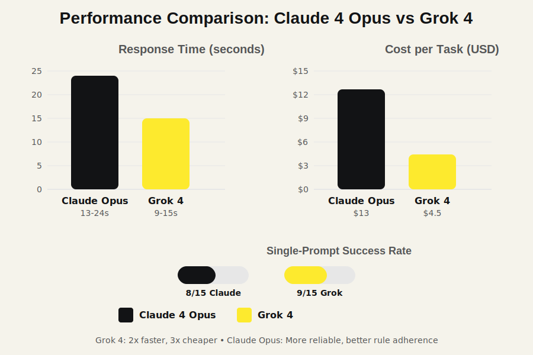
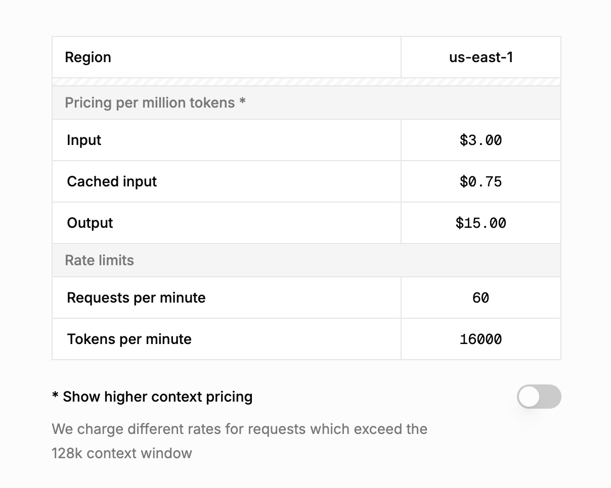
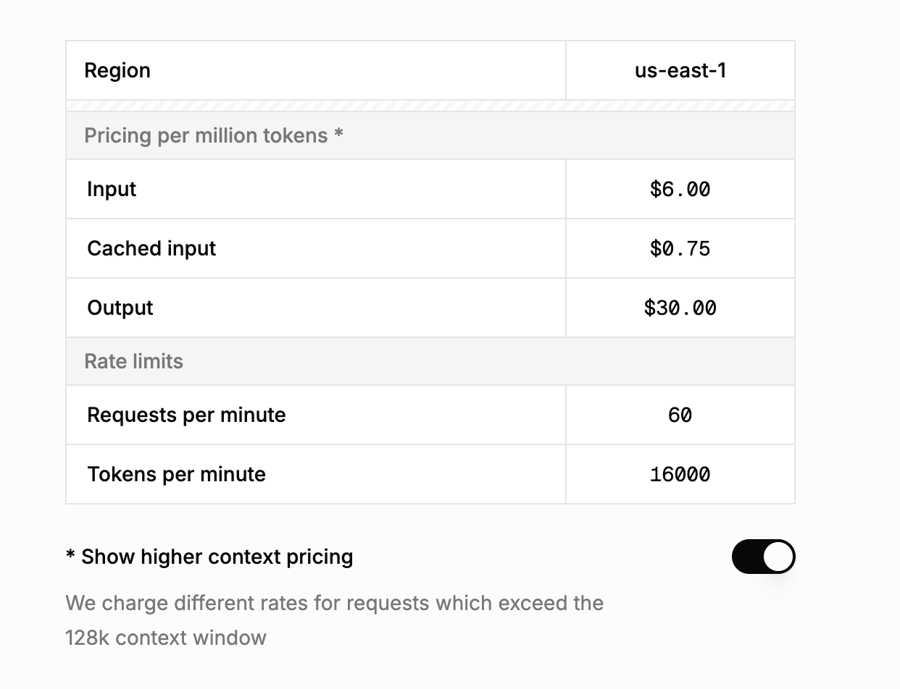

I've been knee-deep in AI-assisted coding for months, and when Grok 4 dropped, I couldn't resist throwing it into the ring with Claude 4 Opus. Using the same 15 complex tasks involving race conditions, deadlocks, and multi-file refactors in a Rust codebase of about ~28k lines of code, I put them head-to-head.

The bottom line? Grok 4 is a powerhouse for identifying complicated, hard-to-find bugs like deadlocks in a complex `tokio` based async Rust project. It's significantly cheaper per task but can occasionally ignore custom instructions. Claude 4 Opus, while more expensive, is more obedient and reliable, especially when you need it to follow specific rules.

:::note
Grok comes with frustratingly low rate limits.
:::

<!--truncate-->

## Testing Methodology and Technical Setup

I threw both models at actual Rust projects I've been working on, focusing on the stuff that actually matters to me: finding bugs, cleaning up code, and using tools properly. Same prompts for both to keep things fair.

### Test Environment Specifications

**Hardware Configuration:**

- MacBook Pro M2 Pro, 16GB RAM
- Network: 500Mbps connection
- Development Environment: VS Code, with [Forge](/docs/installation.mdx) running on integrated Terminal for AI interactions

**API Configuration:**

- Claude 4 Opus: Anthropic API
- Grok 4: xAI API
- Request timeout: 120 seconds
- Max retries: 3

**Task Specifications:**

- 15 tasks involving concurrency issues, code refactors, and fixes
- Mix of small (under 128k tokens) and larger contexts upto 200k tokens
- Custom rules for Design patterns, Library usage and Like using Pretty assertions in tests etc.

**Claude 4 Opus**

- Context Window: 200,000 tokens
- Input Cost: ~$3/1M tokens
- Output Cost: ~$15/1M tokens
- Tool Calling: Native support

**Grok 4**

- Context Window: 128,000 tokens (effective, with doubling cost beyond)
- Input Cost: ~$3/1M tokens (doubles after 128k)
- Output Cost: ~$15/1M tokens (doubles after 128k)
- Tool Calling: Native support

_Figure 1: Speed and cost comparison across 15 tasks_

## Performance Analysis: Quantified Results

### Execution Metrics

| Metric                    | Claude 4 Opus                    | Grok 4                 | Notes                              |
| ------------------------- | -------------------------------- | ---------------------- | ---------------------------------- |
| Avg Response Time         | 13-24s                           | 9-15s                  | Grok 2x faster per request         |
| Single-Prompt Success     | 8/15                             | 9/15                   | Both reached 15/15 with follow-ups |
| Avg Cost per Task         | $13 USD                          | $4.5 USD               | Grok cheaper for small contexts    |
| Tool Calling Accuracy     | ~99% (1789/1803)                 | ~99% (1785/1803)       | Near-perfect for both              |
| XML Tool Calling Accuracy | 83%                              | 78%                    | Opus slightly better               |
| Bug Detection             | Missed race conditions/deadlocks | Detected all           | Grok stronger in concurrency       |
| Rule Adherence            | Excellent                        | Good (ignored in 2/15) | Opus followed custom rules better  |

**Test Sample:** 15 tasks, repeated 3 times for consistency
**Confidence Level:** High, based on manual verification

## Speed and Efficiency: Grok's Edge with a Catch

Grok 4 was consistently faster, 9-15 seconds versus Opus's 13-24 seconds. This made quick iterations feel way snappier. But then I kept slamming into xAI's rate limits every few requests. It turned what should've been a quick test session into a stop-and-wait nightmare. I couldn't even get clean timing data because I was constantly throttled.

## Cost Breakdown: Savings That Scale...

Grok 4 cost me $4.50 per task on average while Opus hit $13. That's a big win for smaller jobs. But Grok's pricing doubles after 128k tokens. Opus pricing stays flat.

Here's what Grok's pricing structure looks like in practice:

_Figure 3: Grok 4 standard pricing for contexts under 128k tokens_

When you enable "higher context pricing" (which kicks in automatically for larger contexts), the costs double:

_Figure 4: Grok 4 pricing for contexts over 128k tokens - notice the doubled rates_

## Accuracy and Capabilities: Where Grok Shines (and Slips)

Grok 4 impressed me by spotting a deadlock in a tokio::RwLock-based setup that Opus completely missed. In one task, Grok identified a subtle thread drop that prevented the panic hook from executing in a Rust async block. Something Opus glossed over.

Both nailed tool calling at 99% accuracy, picking the right tools with valid args nearly every time. Switching to an XML-based setup dropped that: Opus hit 83%, Grok 78%. Solid, but not flawless.

Rule-following was where things got interesting. My custom rules (tuned over months using Anthropic's eval console) worked perfectly with Opus. Grok ignored them twice out of 15 tasks. Could be because I optimized these rules specifically for Claude models, but it still broke my flow when it happened.

For single-prompt completions, Grok edged out with 9/15 versus Opus's 8/15. With follow-up instructions, both aced everything, showing they're both capable but Grok might "get it" faster out of the gate.

## Frustrations and Real-World Implications

The rate limiting on Grok was incredibly frustrating. I'd send a request, get a good response, then hit a wall for the next few minutes. It completely killed my testing momentum.

In terms of model behavior, Opus felt more "obedient," sticking to rules without deviation. Grok was bolder, sometimes ignoring constraints for what it thought was a better approach. That creativity helped with bug hunting but could lead to scope creep in team settings.

## Conclusion

After all this, I'm leaning toward Grok 4 for complex tasks purely for the cost savings and speed, plus that eagle-eye for complex bugs. It completed more tasks on the first try and ran cheaper, even if the rate limits drove me nuts. Opus is reliable and follows rules consistently, making it the safer choice when you need predictable results and can't afford surprises.

Ultimately, Grok 4's value won me over for my specific needs, but definitely test both yourself. Each has clear strengths depending on what you're building.

## Try Grok 4 on Forge

We've enabled Grok 4 on Forge! If you're curious to experience the speed and bug-hunting capabilities we discussed, [sign up for Forge](https://app.forgecode.dev) and give it a shot. You can compare it directly with Claude 4 Opus and see which model works better for your specific coding tasks.
